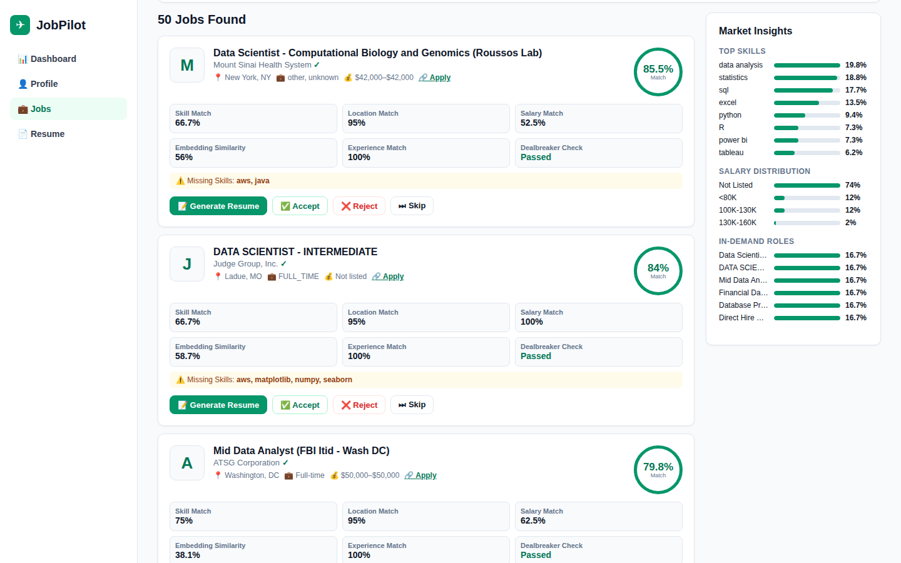

# JobPilot — Job Matching & Resume Tailoring

JobPilot matches a candidate's profile against tens of thousands of job postings, explains **why** each job is a fit, learns from the candidate's accept / reject / skip feedback, and generates a tailored resume and cover letter for any job with Claude.

**Live demo:** https://jobpilot-bax423-final-839731102906.us-west1.run.app
Pick a demo persona at the top right (for example *Marcus — New Grad*), open **Jobs** and click **Find Matching Jobs**.



## What it does

- **Profile intake**: pick a demo persona, fill in a profile, or upload a PDF resume (parsed with Claude).
- **Search 30,000 postings** from a Kaggle job-postings snapshot, enriched with live postings from the Adzuna API.
- **Respect dealbreakers**: no senior roles, no contract work, no 3+ years required, visa sponsorship needed, US only, and more.
- **Explainable ranking**: every job gets a 1–99 match score with its parts shown (skill, location, salary, experience, embedding similarity) and the skills you're missing.
- **Learns from feedback**: accept / reject / skip adjusts future rankings for that profile.
- **Tailored resume and cover letter** for any job, editable in the app.
- **Market insights dashboard**: top skills, salary distribution and in-demand roles across the dataset.
- **Export** the top jobs to CSV / JSON.

## How it works

| Stage | Method |
|---|---|
| 1. Ingestion | Stream job postings from CSV, fetch live Adzuna postings when API keys are set, normalize salary / location / employment type, extract skills with 60+ patterns, remove duplicates by a job identity hash |
| 2. Retrieval | Title (weighted ×3), skills, industry and description → TF-IDF (20k features, bigrams) → TruncatedSVD to 150 dimensions (LSA) → top-1,000 candidates by cosine similarity |
| 3. Hard filters | The profile's dealbreakers: seniority, contract / temp / unpaid, required years, defense employers, US-only, visa sponsorship |
| 4. Scoring | 10-feature weighted model: role match (22 pts), skill match (18), preference match (14), location (12), salary (8), experience (6), seniority (4), embedding similarity, metadata quality, feedback boost |
| 5. Feedback | Profile-scoped learner updates job-level and feature-level weights on every accept / reject / skip; NDCG@10 is tracked across rounds |
| 6. Generation | Claude writes a tailored resume and cover letter from the profile and the selected job, with a rule-based fallback when no API key is set |

## Results

| Metric | Result |
|---|---|
| Postings ingested | 31,200 raw → 28,267 indexed (2,933 duplicates removed) |
| Retrieval latency | LSA 18.55 ms avg (sparse TF-IDF baseline 6.03 ms). LSA finds related roles such as “ML Engineer” ≈ “Applied Scientist” that keyword matching misses |
| End-to-end search | 127–357 ms |
| Persona tests | 4 of 4 personas pass with 0 dealbreaker violations; top-10 average match 78.0%–90.5% |

Details are in the [technical brief](brief.pdf).

## Tech stack

Python · FastAPI · scikit-learn (TF-IDF, TruncatedSVD) · pandas · Claude API · Adzuna API · vanilla HTML / CSS / JavaScript · Docker · Google Cloud Run

## Run locally

```bash
pip install -r requirements.txt

# Optional: live API features
cp .env.example .env   # add ANTHROPIC_API_KEY, ADZUNA_APP_ID, ADZUNA_APP_KEY

bash run_local.sh      # open http://localhost:8000
```

Everything works without API keys: resume generation falls back to templates and search uses the offline job data.

### Data

The repository includes `data/jobs_sample.csv`, a 2,000-posting sample, so the app runs out of the box. The live demo uses the full 30,000-posting snapshot from [Techmap's job postings datasets on Kaggle](https://www.kaggle.com/techmap). To use the full data, download it, save it as `data/jobs.csv` (or set `KAGGLE_CSV` to its path; JSONL files are supported too) and restart.

Many postings don't list salary, visa sponsorship, company size or required years. JobPilot shows those as *Not listed* / *Unknown*, gives them a small ranking penalty, and prefers API-enriched postings when available.

## Deploy

`Dockerfile` builds a container for Google Cloud Run (`gcloud run deploy --source .`); `render.yaml` deploys to Render. Set the API keys as environment variables on the service.

## About this project

Built as the final project for BAX-423 Big Data (UC Davis MSBA, Spring 2026). I designed the product and pipeline and built it with AI coding tools (Claude and Cursor), iterating through prompts. The prompts and how they evolved are in [prompts.md](prompts.md).
